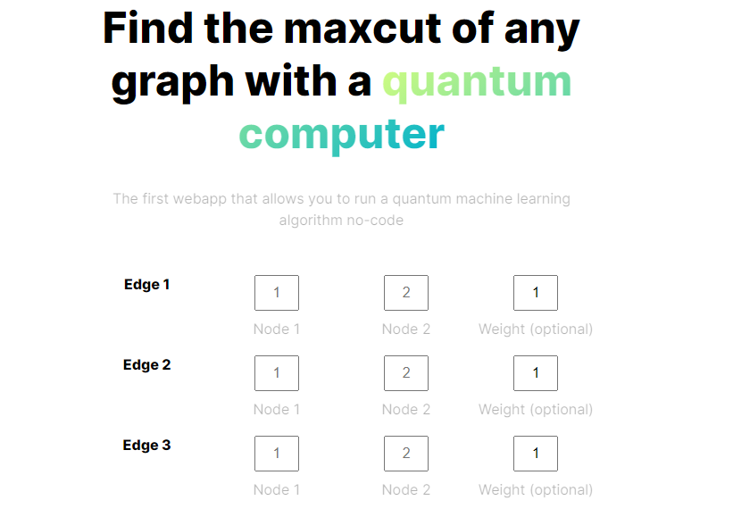
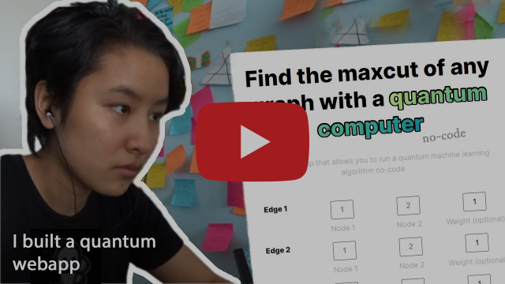

# Find the maxcut of any graph with a quantum computer

The Quantum Maxcut Solver is the first webapp that allows anyone to run a quantum machine learning algorithm no-code. It uses QAOA (the quantum approximate optimization algorithm, a quantum machine learning algo) to solve the [maxcut problem](https://postulate.us/@laura/p/2021-05-17-What-is-maxcut%3F-dYuqZASdgoG6cFjh1LTC9E). Instructions for usuage are included at [maxcut.vercel.app](https://maxcut.vercel.app/). Or, to learn more about maxcut and the theory behind QAOA, check out [this video](https://youtu.be/jYS6YEFza9Q).

Built on a [React frontend](https://github.com/laurgao/maxcut-frontend) and a Flask backend (this repository). Check out [this blog post](https://postulate.us/@laura/p/2021-05-15-Using-Python-in-a-React-d2zcBGbfSxrJjCqv6wtxyi) for more dev notes.